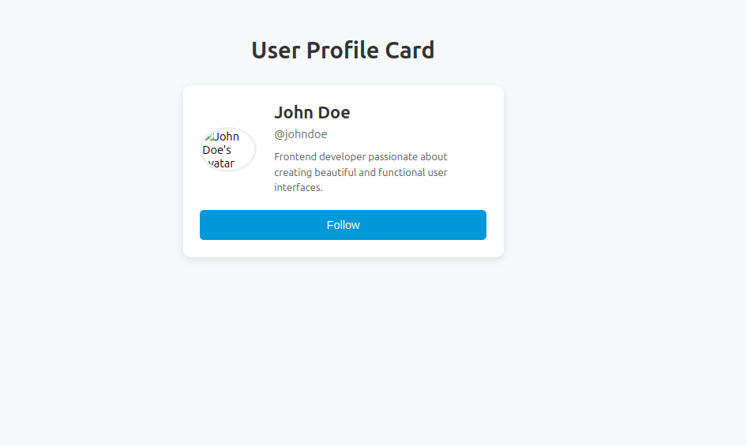
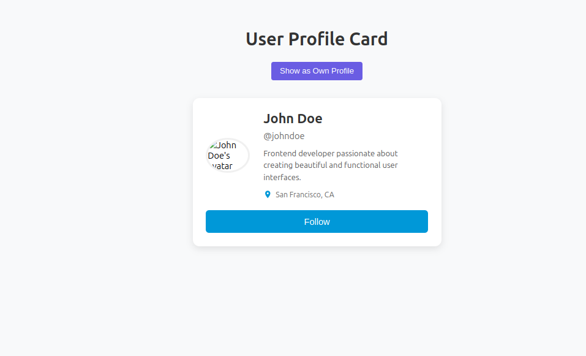
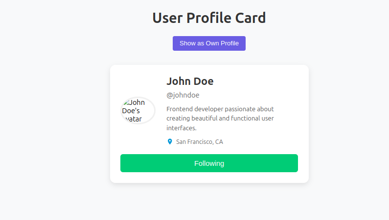
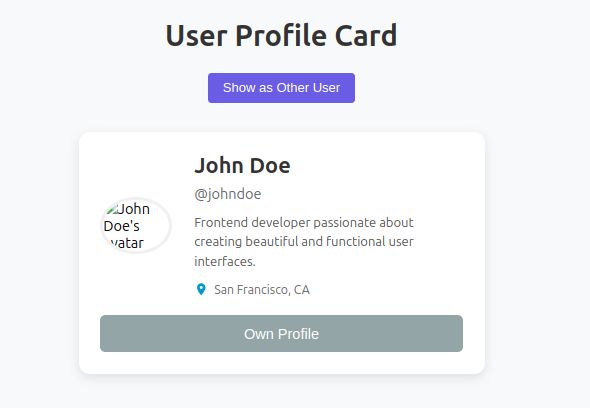
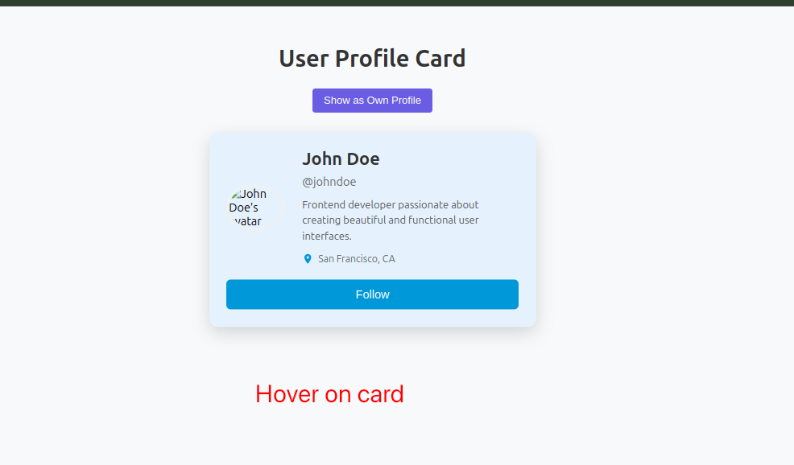

# User Profile Card - React Component

A clean, modern, and responsive user profile card component built with React using windsurf.

## Features

- Circular avatar image with placeholder
- User's full name display
- Username with @ prefix
- Short bio section
- Location display with icon
- Interactive Follow button with state toggle
- Conditional rendering for "Own Profile" state
- Responsive design for all devices
- Clean, modern UI with subtle animations

## Installation

```bash
npm install
npm start
```

## Implementation Screenshots

### Initial User Profile Card


### Modification 1: Follow Button Toggle


### Modification 2: Follow Button Toggle


### Modification 3: Own Profile State


### Modification 4: Background Color Change on Hover


## Prompts Used

### Part 1 Prompt
```
craete a user profile card using react

user profile card requirments
A placeholder for a user avatar (circular image).
User's full name.
Username (e.g., @username).
A short bio section.
A "Follow" button.


Use default values for all props
Avatar should be 1:1 aspect ratio
Avoid external library except react
Make it look clean and modern
Ensure responsive design for all devices
Use best design pratices.


use the current directory.
```

### Part 2 Prompt
* Used windsurf AI to improve the user profile card with following prompot.

```
improve the user profile card with

Interactivity: Make the "Follow" button toggle its text between "Follow" and "Following" when clicked use a global state using context.

New Element: Add a section to display a "Location" (e.g., "San Francisco, CA"). format it properly with icon.

Styling Change: Change the background color of the card when the mouse hovers over it.

Conditional Logic (Conceptual):making the "Follow" button appear disabled and show "Own Profile" if a hypothetical isOwnProfile prop/variable was true. have a button which will togel the IsOwnProfile var and  pass it to profile card.
```

## Implementation Process

No manual refinements were needed as the AI-generated code worked perfectly for the requirements. The implementation process was smooth, with the Context API providing a clean solution for global state management without external libraries.
